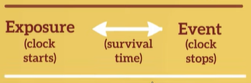
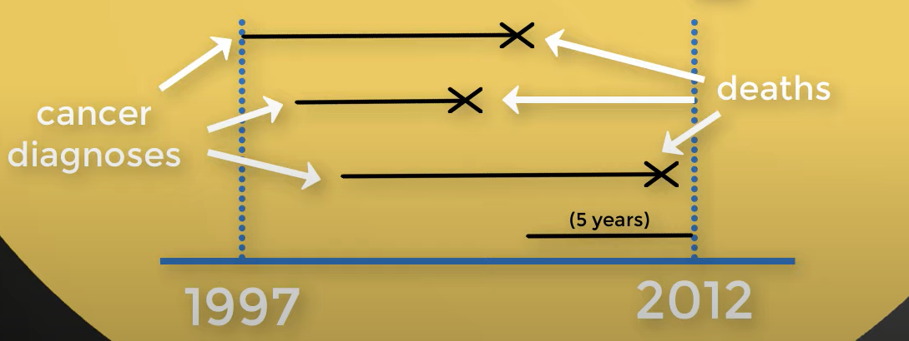
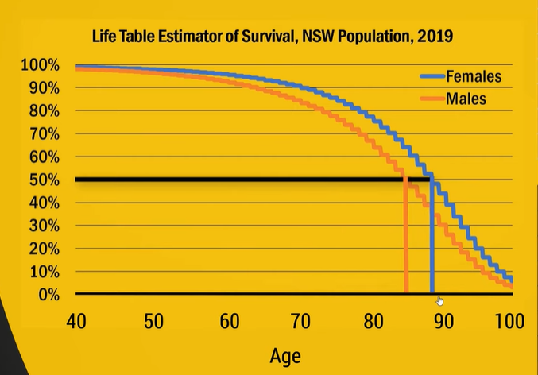
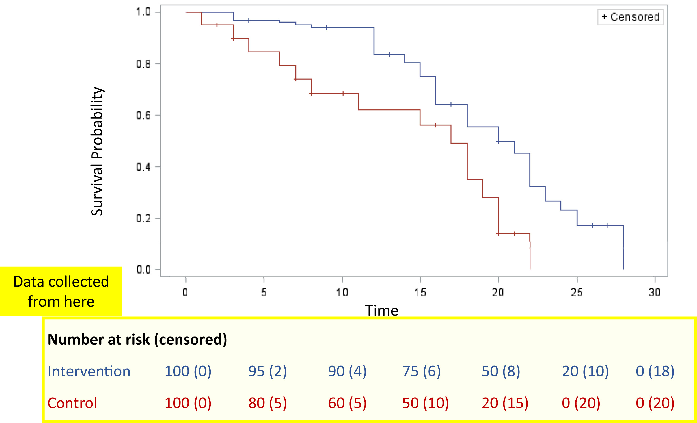
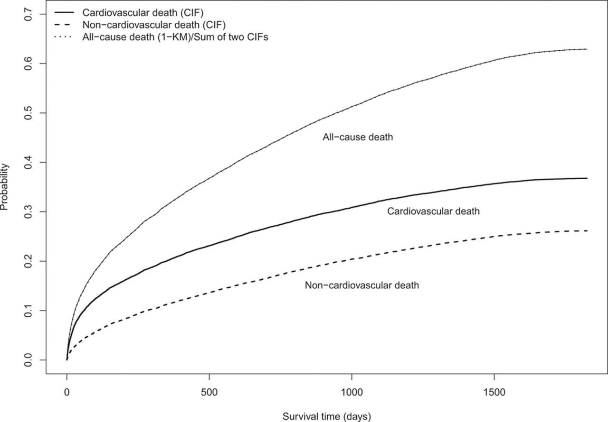
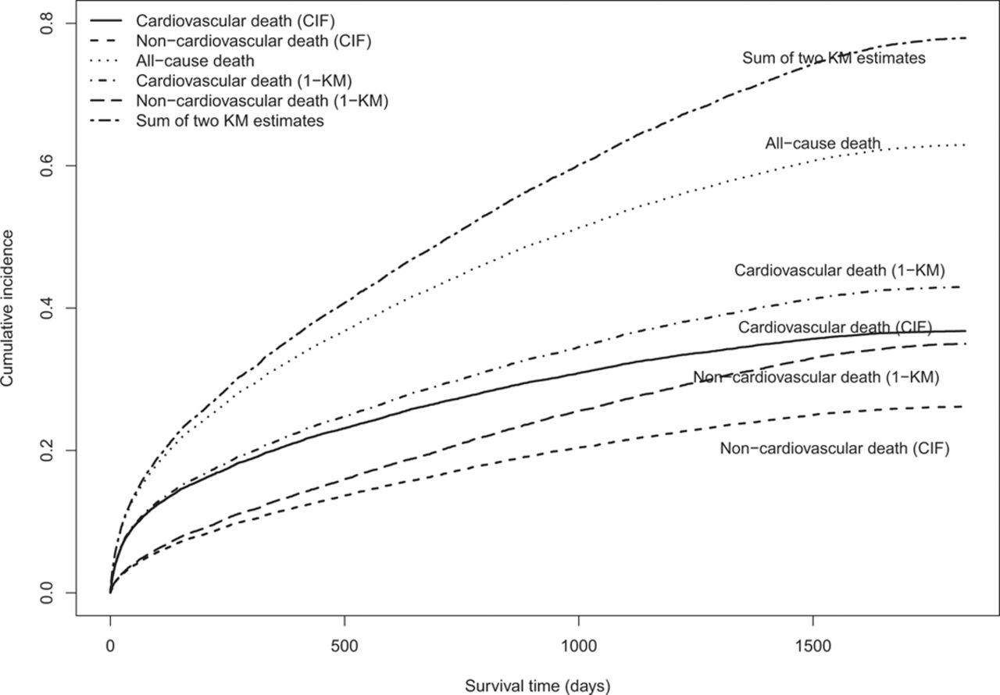

class: inverse, center, middle

```{r set up, include=FALSE}
library(survival)
library(survminer)

# load in data
time <- c(4,6,8,11,15,15,20,20,25,31)
status <- c(1,1,0,1,1,1,1,0,1,0)
sex <- c(1,1,1,2,1,1,2,2,2,2)
df <- data.frame(time, status, sex)

# table and curves using log-log
fit <- survfit(Surv(time, status) ~ 1, conf.type = "log-log", df)
summary(fit)
ggsurvplot(fit, df)

# by sex
fit2 <- survfit(Surv(time, status) ~ sex, conf.type = "log-log", df)
ggsurvplot(fit2, data = df)
```


# Recap
### Survival analysis

---
### Recap

- Survival analysis is known as "**time-to-event**" analysis. (e.g. hepatitis diagnosis to death)
<br>
<br>
--
```{r echo=FALSE, message=FALSE, warning=FALSE}

```
--

- Survival time is of particular interest (DM project is a nice example of why survival analysis is not performed; however, cancer studies are quite the opposite).

--

- Time to ...
<br>
<br>
Death
<br>
<br>
--
Device/ drug failure
<br>
<br>
--
Re-admission
--
<br>
<br>
...

---

# Censoring

**Censoring** occurs when we don't know the exact time-to-event for an included observation.

--

1. LEFT: we know that time-to-event is LESS than some value. (Young women enrolled in the study who have already menstruated)

--

2. INTERVAL: we know that time-to-event is BETWEEN two values. (Lesion occurrence is identified by a specialist at regular checkups)

--

3. RIGHT: we know that time-to-event is GREATER than some value. (MOST COMMON, usually consider patients still alive at end of study; or patients lost to follow up)

--


---
# Life Tables


---

# Keplan Meier Curves


---
# KM survival curves in R

```{r eval=FALSE}
library(survival)
library(survminer)

# load in data
time <- c(4,6,8,11,15,15,20,20,25,31)
status <- c(1,1,0,1,1,1,1,0,1,0)
sex <- c(1,1,1,2,1,1,2,2,2,2)
df <- data.frame(time, status, sex)

# table and curves using log-log
fit <- survfit(Surv(time, status) ~ 1, conf.type = "log-log", df)
summary(fit)
ggsurvplot(fit, df)

# by sex
fit2 <- survfit(Surv(time, status) ~ sex, conf.type = "log-log", df)
ggsurvplot(fit2, data = df, pval = TRUE, conf.int = TRUE, risk.table = TRUE, risk.table.col = "strata", linetype = "strata", surv.median.line = "hv", ggtheme = theme_bw(), palette = c("#E7B800", "#2E9FDF")) #<<
 
# Logrank test
survdiff(Surv(time, status) ~ sex, data = df) #<<

```
---
# Logrank test

The logrank test assesses whether the KM survival curves from two subgroups are **significantly different**.

```{r echo=FALSE, message=FALSE, warning=FALSE}
fit2 <- survfit(Surv(time, status) ~ sex, df)
ggsurvplot(fit2, data = df, pval = TRUE, conf.int = TRUE, risk.table = TRUE, risk.table.col = "strata", linetype = "strata", surv.median.line = "hv", ggtheme = theme_bw(), palette = c("#E7B800", "#2E9FDF"))
 
```

---
class: inverse, center, middle
# Competing risk analysis

---
# Background

A distinctive feature of survival data is the concept of censoring. In a follow-up study, subjects who drop out are censored, because they are typically lost to follow-up and the time of the occurrence of their event is unknown. All that is known is that their event time occurred after the time at which they were censored. If the study had been prolonged (or if subjects had not dropped out), eventually the outcome of interest would have been observed to occur for all subjects. 

Conventional survival analysis make the important assumption of **independent or non-informative censoring**. This means that, at a given point in time, subjects who remain under follow-up have the same future risk for the occurrence of the event as those subjects no longer being followed (either because of censoring or study dropout), as if losses to follow-up were random and thus non-informative.

---
class: inverse, center, middle
# But...

---

# Competing risk

- A competing risk is an event whose occurrence precludes the occurrence of the primary event of interest. For instance, in a study in which the primary outcome was time to death attributable to a cardiovascular cause, death attributable to a non-cardiovascular cause serves as a competing event. 

- A subject who dies of cancer is no longer at risk of death attributable to cardiovascular causes. Regardless of how long the duration of follow-up is extended, a subject will not be observed to die of cardiovascular causes once he or she has died of cancer. 

- Conventional statistical methods for the analysis of survival data assume that competing risks are absent. Two competing risks are said to be independent if information about a subject’s risk of experiencing 1 type of event provides no information about the subject’s risk of experiencing the other type of event. 

---
class: center, middle


---
class: inverse, center, middle
The CIF is equivalent to 1-KM estimator when there is no competing event. When there is competing event, the CIF differs from 1-KM estimator in that it uses overall survival function S(t) that counts failures from competing events in addition to the event of interest.
---
class: center, middle

---
# Solutions for Competing Risk Analysis

- **Cumulative incidence functions (CIFs)** should be used to estimate the incidence of each of the different types of competing risks. Do not use the Kaplan-Meier estimate of the survival function for this purpose.

- Researchers need to decide whether the research objective is on addressing etiologic questions or on estimating incidence or predicting prognosis.

- Use the **Fine-Gray subdistribution hazard model** when the focus is on estimating incidence or predicting prognosis in the presence of competing risks.

- Use the **cause-specific hazard model** when the focus is on addressing etiologic questions.

- In some settings, both types of regression models should be estimated for each of the competing risks to permit a full understanding of the effect of covariates on the incidence and the rate of occurrence of each outcome.

---
class: inverse, center, middle
# [Example](https://www.ahajournals.org/doi/10.1161/circulationaha.115.017719#d754422e1)

---

class: center, middle

# Thanks!

.footnote[

[Reference1](https://www.ahajournals.org/doi/10.1161/circulationaha.115.017719#d754422e1)

[Reference2](https://www.publichealth.columbia.edu/research/population-health-methods/competing-risk-analysis)
]

